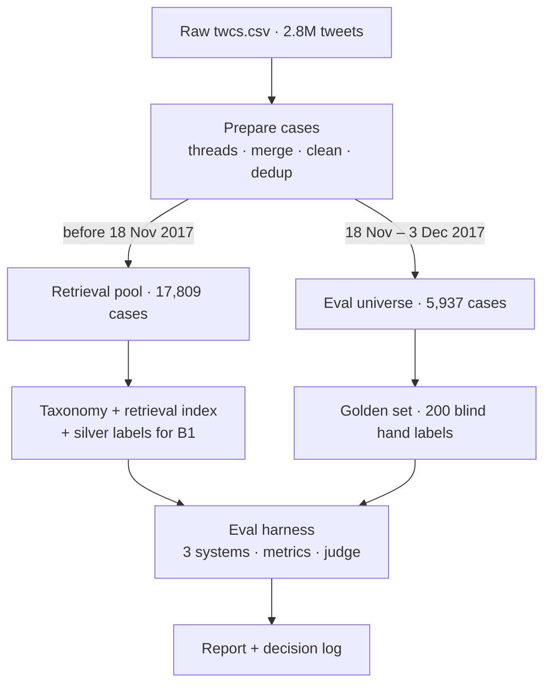
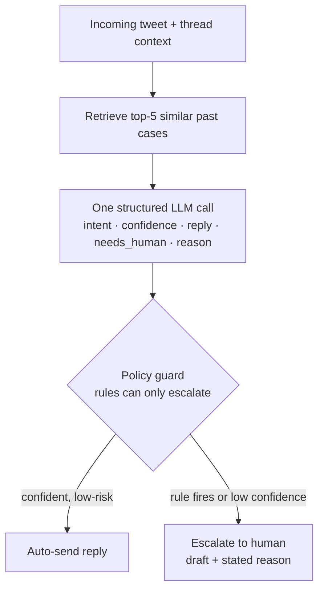

# Design — British Airways support agent

*Status: approved 2026-09-10; revised the same day to local-first, provider-agnostic models
(decision log #17). This document is the skeleton of the final report; sections marked (report)
carry over and get filled with results.*

The brief says the proof is worth more than the system. Every choice below is
made to strengthen the evidence, not to make the agent more elaborate.

---

## 1. Problem framing (report)

### What "good" means for British Airways
A good reply is one BA could post publicly **without a human editing it**:
- answers what the customer actually asked;
- invents nothing: no flight times, policy details, compensation amounts, or promises;
- gives one concrete next step;
- sounds like BA and is proportionate to the customer's mood;
- never asks for personal data in public.

### The costs are lopsided
A bad auto-sent reply is public, permanent, and screenshot-able. An unnecessary
escalation costs an agent about a minute. So we optimise **safe coverage**
(how much we can auto-handle while keeping bad posts rare), not accuracy.

### Definition of "escalate"
*Escalate* = a human must see the message before anything is posted.
A reply like "please DM us your booking reference" is safe to auto-send: the case
continues in DMs, where a human picks it up. "Auto-handled" therefore means
"safe to post", not "fully resolved".

Every escalation reason describes a case where **a generic reply would be harmful or make
things worse**. For bookings that means urgency: *Needs booking access* applies only when the
customer is travelling within about 24 hours, is at the airport, or is about to miss a flight or
connection, so a canned "DM us" would leave them waiting in a queue. Non-urgent booking requests
are auto-handled with a DM hand-off (decision log #16).

### What we chose not to build
| Not building | Reason |
|---|---|
| Access to booking / flight systems | We don't have them. The agent must never claim to have checked a booking, which is a testable rule. |
| Full multi-turn dialogue | We draft one reply per message, using prior turns as context. Whole-conversation planning can't be evaluated from this data. |
| Fine-tuning | 200 labels can't validate it; retrieval gets most of the benefit. |
| Vector database | ~18k vectors is a millisecond brute-force search in numpy. |
| Banking77 | Banking intents don't transfer to an airline. Scope without evidence. |
| Live UI / Twitter integration | Doesn't strengthen the proof. First item for "one more week". |

---

## 2. Data

- Source: Customer Support on Twitter (Kaggle `thoughtvector/customer-support-on-twitter`),
  obtained via the HuggingFace mirror `SunidhiSriram/twcs` (same file, 516,508,641 bytes).
- Brand chosen empirically: see `scripts/00_brand_scan.py`, `01_brand_scan_v2.py`,
  `02_pair_yield.py` and decision log #1–3.

| | Cases | Window |
|---|---|---|
| Retrieval pool (past) | 17,809 | effectively 1 Oct – 18 Nov 2017 (236 stray older cases) |
| Eval universe (future) | 5,937 | 18 Nov – 3 Dec 2017 |

Eval-window check: daily volume is flat (16 days, 238–487 per day, largest single-day
share 8.2%), so no single incident dominates by volume.

---

## 3. Architecture

### Offline data flow
Anything after the temporal cut is used **only** for evaluation.

### Runtime agent

Escalated cases still carry a draft, so the human edits it rather than starting from scratch.
Every model is reached through a *role* (embedding, generator, namer, judge); section 6 describes
how roles map to providers.

---

## 4. Components

### C1 Data preparation (`src/prepare.py`)
- **Thread reconstruction**: walk reply chains to the root so every case keeps its prior turns.
- **Multi-part merge**: BA splits answers across tweets ("1/2", "2/2"); unmerged, half the answers are truncated.
- **Cleaning**: unescape HTML, replace URLs with `<link>`, strip anonymised @ids, and strip agent sign-offs
  (`^Jane`, `^HP`, `^Beth S.`…) from BA's tweets only; 81% of BA tweets carry one (decision log #14).
- **Near-duplicate removal** (5,149 dropped): burst events would otherwise flood retrieval and eval.
- **Temporal split (75/25)**: a random split leaks same-incident replies into retrieval.

### C2 Intent taxonomy, induced from data (`src/taxonomy.py`)
- Embed ~5k pool messages (local `all-MiniLM-L6-v2`) → k-means sweep (k = 8…20) → describe each
  cluster by distinctive words, the messages nearest its centre, and random members.
- Cluster names: suggested by a local LLM when one is available, **clearly attributed to that
  model**; otherwise left blank. Either way **a human curates** the final 8–10 intents with
  definitions and boundary rules, and `taxonomy.py finalize` validates the curation and writes
  `data/golden/taxonomy.json`.
- The curated cluster → intent mapping also yields **silver labels** (nearest centroid) for B1
  and for targeted golden sampling, so neither needs an LLM labeller.
- Intent and escalation are **separate labels**. There is no "escalate" intent.
- Keep **other / non-actionable** rather than filtering it out.
- **Single label** per message, chosen by the rule *what does the customer want BA to do?*

### C3 Retrieval index
- `all-MiniLM-L6-v2` (384 dims, local, revision pinned) over pool customer messages;
  brute-force cosine in numpy; embeddings cached on disk.
- Match on the customer message; return (customer message, BA reply) pairs as exemplars.
- Risk: exemplars contain case-specific facts. The prompt forbids copying them and the
  fabrication detector catches leaks.

### C4 Agent: one structured call
- Output `{intent, intent_confidence, needs_human, escalation_reason, reply}` from the
  `generator` role: locally `qwen2.5:3b` via Ollama; optionally `gpt-4.1-mini-2025-04-14`
  with `--live`. Temperature 0, fixed seed.
- One call instead of three: the reply and the escalation decision share one reading of the
  message, at ⅓ of the cost, with one prompt to explain. Each field is still scored separately.
- Escalation reasons are a fixed list of eight plus free text, defined once in
  `config/escalation_reasons.json` and shared by the labelling tool, the agent and the metrics:
  needs booking access · safety / medical · legal threat · compensation dispute ·
  disputed policy / factual claim · repeated contact · reputational risk · unclear request.
  The exact boundaries live in the labelling guidelines.

### C5 Policy guard: deterministic, runs after the LLM
- Rules for legal threats, compensation / EU261 / money amounts, safety and medical issues,
  personal data posted publicly, and repeated contact.
- **Monotone**: it can only escalate, never downgrade. An ablation measures its safety gain and coverage cost.

### C6 Baselines and ablations
| System | Intent | Reply | Escalation |
|---|---|---|---|
| B0 trivial | majority intent | one fixed "Sorry to hear that, please DM us" | escalate-all *and* auto-all |
| B1 simple | TF-IDF + LR on silver labels (curated cluster mapping, pool) | nearest past BA reply, verbatim | guard rules only |
| A agent | LLM | retrieval + generation | LLM + guard |
| A − retrieval | LLM | no exemplars | LLM + guard |
| A − guard | LLM | retrieval + generation | LLM only |

B1 answers the obvious objection: "why not just reuse what BA said last time?"
B0 and B1 need no LLM at all; the A rows need the `generator` role.

### C7 Golden set: 200 examples, eval universe only
- **130 uniform random** (unbiased headline numbers) + **70 targeted** (rare intents via silver labels,
  escalation triggers, long threads), reported separately. The stratum is hidden from the labeller.
- Labels: intent · should-escalate + reason · is BA's actual reply acceptable? · ambiguity flag.
- Protocol: guidelines written first; **blind** (no model output shown); BA's real reply is revealed
  only after intent and escalation are set; fixed random order;
  30 items re-labelled at least 24 h later → intra-annotator κ. Optional second labeller on 40 → inter-annotator κ.
- **Practice exposure (disclosed).** 57 of the 130 uniform cases were seen, with BA's replies, in a
  practice round. They are pre-set from the labeller's latest practice judgements (escalation, reason,
  BA rating; intent only where it mapped cleanly) and reviewed case by case; 4 from before the
  urgent-booking rule are judged fresh. Headline metrics stay on the uniform 130 and the 130/70 split is
  unchanged; practice-vs-final agreement is a secondary analysis only (decision log #20).

---

## 5. Evaluation methodology (report)

**Intent**: accuracy, macro-F1, per-class P/R, confusion matrix; bootstrap 95% CIs;
paired bootstrap for differences between systems.

**Escalation** (cost-weighted):
- must-escalate recall (the safety metric);
- unsafe-auto rate = P(should escalate | auto-sent);
- coverage = share auto-handled;
- risk–coverage curve over a confidence threshold (Geifman & El-Yaniv, 2017), with B0's two extremes as anchors;
- confidence = self-consistency over 5 samples (Wang et al., 2022); verbalised confidence
  as an ablation, since it is known to be overconfident (Xiong et al., 2024).

**Reply quality**, in three layers:
1. Deterministic checks: length ≤ 280; a fabricated-specifics detector (flight numbers,
   times, amounts, dates, phone numbers that don't appear in the input); promise language; public requests for personal data.
2. Similarity to BA's actual reply (embedding cosine, ROUGE-L), reported as a
   **flawed** metric. B1 is expected to win it, which shows it rewards mimicry.
3. LLM judge (the `judge` role: locally `llama3.2:3b`, a different model family from the
   generator; optionally `gpt-5-mini` with `--live`): relevance, groundedness, actionability,
   tone and public-safety on anchored 1–3 scales, plus a binary **sendable as-is**. Rationale
   before score; blind to system; random order. Pairwise comparison against BA's real reply in
   both orders; only consistent verdicts count. **A local judge's scores are reported as such and
   are not treated as equivalent to the planned GPT-class judge.** With no local LLM available,
   the judge layer is skipped and reply quality rests on layers 1–2 plus the human scores.

**Judge validation**:
- 80 human-scored replies, split 30 dev (rubric tuning) / 50 test (reported).
- Quadratic-weighted κ per dimension; κ on sendable; confusion matrices;
  human self-agreement on 25 re-scored items as the ceiling.
- Bias probes: self-preference (re-score with the generator's model as judge; system × judge interaction),
  position (swap-flip rate), verbosity (judge − human residual vs reply length).

**Pre-registered trust bar** (fixed before any results):
must-escalate recall ≥ 0.95 (CI lower bound ≥ 0.90); unsafe-auto ≤ 5%;
sendable-when-auto ≥ 85%. The conclusion may be per intent:
"auto-send for intents X and Y; draft-only for the rest."

---

## 6. Reproducibility and model providers
- **Roles, not vendors.** Code asks `src/llm.py` for a role; `config/models.json` maps each role
  to a model per profile. Providers live in `src/providers.py`: `OllamaProvider` (local),
  `OpenAIProvider` (optional, paid), `MockProvider` (tests only), `SentenceTransformerEmbedder`
  (local) and `OpenAIEmbedder` (optional, paid).
- **Three modes**, chosen per run:
  - `--local` (default): free models on this machine. Never calls a paid API.
  - `--offline`: replay the cache only. No model runs and no network is used; a cache miss is an
    error. Needs only `requirements.txt` (numpy, pandas, scikit-learn).
  - `--live`: allows the paid OpenAI API. Must be requested explicitly; paid providers refuse to
    start otherwise.
- **Cache.** Chat responses in `cache/chat.jsonl`, embeddings in `cache/embeddings/<spec>.npz`,
  keyed by a hash of (model spec, input, params). The spec names the provider, so outputs from
  different models can never be mixed. Mock outputs are never cached. The cache is committed.
- **Tested guarantees** (`tests/test_llm_modes.py`): paid providers cannot start outside
  `--live`; the `openai` package is never imported in local runs; `--offline` computes nothing;
  only localhost is contacted; tests never write to the cache.
- **Provenance.** Every result records `llm.run_info()`: the mode, profile, and each role's model.
- Pinned model revisions (the embedding model's HuggingFace revision) and fixed seeds.
- Dependencies: `requirements.txt` (core, offline), `requirements-local.txt` (local models),
  `requirements-live.txt` (optional paid provider).
- Secrets: the OpenAI key, if any, lives in `.env` (git-ignored), is read only in `--live` mode,
  and is never printed.
- The repo ships the processed BA subset, not the 516 MB raw file; `prepare.py` regenerates it.
  **TODO: confirm the dataset license before committing derived data.**
- Windows: force UTF-8 I/O (emoji in tweets crash the default cp1252 console).

---

## 7. Models and their limitations (report)

| Role | Local profile (default, free) | Live profile (optional, paid) |
|---|---|---|
| embedding | `sentence-transformers/all-MiniLM-L6-v2` (384-d, pinned revision) | `text-embedding-3-small` (512-d) |
| generator | `qwen2.5:3b` via Ollama | `gpt-4.1-mini-2025-04-14` |
| namer | `qwen2.5:3b` via Ollama | `gpt-4.1-2025-04-14` |
| judge | `llama3.2:3b` via Ollama (different family from the generator) | `gpt-5-mini-2025-08-07` |

Limitations, stated rather than hidden:
- **Ollama is not installed on the development machine.** Until a local LLM is available, the A
  rows of C6 and the LLM judge cannot run; B0, B1, the guard, all metrics, the deterministic
  checks and human scoring can.
- **MiniLM is a smaller embedding model** than OpenAI's; retrieval and clustering quality may be
  lower. English-only; inputs over 256 word pieces are truncated (tweets fit).
- **3B local models** follow instructions and emit valid JSON less reliably than GPT-4-class
  models. Invalid outputs are counted and reported, never silently dropped.
- **Speed.** On this CPU (Ryzen 5 5500U, no CUDA GPU) a 3B model is estimated at 30–90 minutes
  per 200-case run, and 5-sample self-consistency multiplies that by five; the verbalised-confidence
  ablation may have to stand in for it, which will be reported if so.
- **A local judge is not the planned GPT-class judge.** Its agreement with the human scores is
  measured and reported separately; its numbers are never presented as equivalent.

---

## 8. "What is misleading about my headline number": candidates (report)
- The taxonomy designer is also the golden-set labeller → optimistic intent accuracy; single annotator.
- 57 of the 130 headline cases were first judged in a practice round with BA's reply visible, then
  reviewed from pre-set values: less blind than the protocol intended.
- BA's historical reply isn't ground truth, and there is no outcome data, so every reply metric is a proxy.
- "Sendable" ≠ "resolved": most good replies still hand off to DMs.
- The judge is a small local model, not the planned GPT-class judge; its agreement with the human
  is measured, not assumed.
- The numbers describe a 3B model on a laptop CPU, not the system a support team would deploy.
- The eval covers 16 days of late 2017.
- n = 200: an 80% rate is really about ±6 pp.

---

## 9. Schedule
| Day | Work |
|---|---|
| 1 | Taxonomy induction, labelling guidelines, golden sampling, **label 200 (~2 h)** |
| 2 | Agent, baselines, guard, deterministic checks, harness, cache |
| 3 | Judge + rubric, **score 80 + re-label 30 (~1.5 h)**, ablations, risk–coverage |
| 4 | Failure analysis, report, decision log, README tested on a fresh clone |

## References
- Geifman & El-Yaniv (2017). *Selective Classification for Deep Neural Networks.* NeurIPS.
- Panickssery, Bowman & Feng (2024). *LLM Evaluators Recognize and Favor Their Own Generations.*
- Wang et al. (2022). *Self-Consistency Improves Chain of Thought Reasoning in Language Models.*
- Xiong et al. (2024). *Can LLMs Express Their Uncertainty?* ICLR.
- Zheng et al. (2023). *Judging LLM-as-a-Judge with MT-Bench and Chatbot Arena.*
